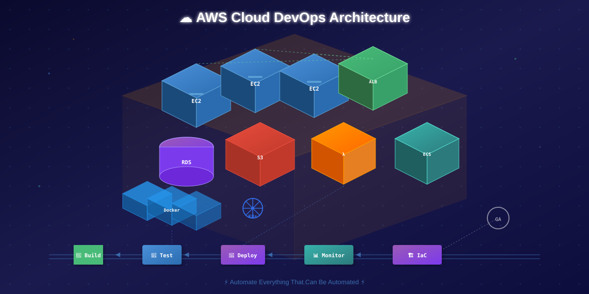
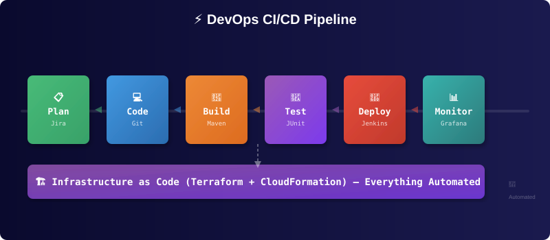

<div align="center">
  
</div>

<h1 align="center">
  
</h1>

<h3 align="center">
  
  
  
  
</h3>

<p align="center">
  
  
  
</p>

---

## <div align="center">🌟 Navigating My Digital Universe</div>

<p align="center">
  <a href="https://github.com/Ashokkunchala"></a>
  <a href="https://linkedin.com/in/ashok-kunchala-127820217"></a>
  <a href="mailto:ashokkunchala10299@gmail.com"></a>
  <a href="https://drive.google.com/file/d/1fZSEfg2T4YuordNXl0Wav3fOe_3dezIX/view?usp=drive_link"></a>
</p>

---

## 👨‍💻 About Me

<table>
<tr>

<td width="55%" valign="top">

```yaml
┌─────────────────────────────────────┐
│         ASHOK KUNCHALA              │
│         DevOps Engineer             │
├─────────────────────────────────────┤
│ Location: Hyderabad, India          │
│ Focus:   Cloud & DevOps Automation  │
│ Goal:    Cloud & DevOps Architect   │
├─────────────────────────────────────┤
│ Core Competencies:                  │
│   • AWS Cloud Architecture          │
│   • Kubernetes Orchestration        │
│   • Terraform / IaC                 │
│   • CI/CD Pipeline Design           │
│   • Docker Containerization         │
│   • Monitoring & Observability       │
├─────────────────────────────────────┤
│ Currently Leveling Up:              │
│   • AWS Solution Architect Assoc    │
│   • EKS Production Operations       │
│   • Terraform Advanced Modules      │
│   • Python Automation               │
│   • OpenSearch                      │
├─────────────────────────────────────┤
│ Fun Fact: Building production-      │
│ grade labs on my local machine.     │
└─────────────────────────────────────┘
```

</td>

<td width="45%" align="center">
  
  <br/><br/>
  
</td>

</tr>
</table>

---

## 🏗️ DevOps Pipeline

<p align="center">
  
</p>

---

## 🏆 What Makes Me Unique

<table>
<tr>
<td width="50%" valign="top">

### 🚀 Core Strengths

| Area | Expertise |
|------|-----------|
| 🔧 Infrastructure Automation | Terraform, CloudFormation |
| 🔄 CI/CD Design | Jenkins, GitHub Actions |
| ☸️ Kubernetes Operations | EKS, Kind, K8s manifests |
| ☁️ AWS Cloud Engineering | EC2, S3, Lambda, VPC, IAM |
| 🐳 Containerization | Docker, ECS, ECR |
| 📊 Monitoring | Prometheus, Grafana, Loki |
| 🔐 Security | IAM Policies, Security Groups |
| 🏗️ IaC | Terraform, Terragrunt |

</td>
<td width="50%" align="center">
  
</td>
</tr>
</table>

---

## 🏠 Home Lab Environment

<table>
<tr>

<td width="50%" valign="top">

| Tool | Purpose |
|:----:|:-------:|
|  **Windows 11** | Host OS |
|  **WSL Ubuntu 24.04** | Development |
|  **Docker** | Containers |
|  **Kind** | Local K8s |
|  **Jenkins** | CI/CD |
|  **Terraform** | IaC |
|  **AWS CLI** | Cloud |

</td>

<td width="50%" align="center">
  
  <br/><br/>
  
</td>

</tr>
</table>

---

## 🛠️ Technology Arsenal

### ☁️ Cloud Platforms
<p align="center">
  
  
  
  
  
  
  
  
  
  
</p>

### 🐳 Containers & Orchestration
<p align="center">
  
  
  
  
</p>

### 🔧 CI/CD & Automation
<p align="center">
  
  
  
  
  
  
</p>

### 📊 Monitoring & Observability
<p align="center">
  
  
  
  
</p>

### 💻 Languages & Scripting
<p align="center">
  
  
  
  
</p>

### 🛠️ Tools & Platforms
<p align="center">
  
  
  
  
  
</p>

---

## 🚀 Featured Projects

<table>

<tr>
<td width="50%" valign="top">

### ☸️ Kubernetes Monitoring Stack

| Component | Description |
|-----------|-------------|
| **Prometheus** | Metrics collection & alerting |
| **Grafana** | Visualization & dashboards |
| **Alertmanager** | Alert routing & notification |
| **Loki** | Log aggregation |

**Tech:** `Prometheus` `Grafana` `Alertmanager` `Loki` `Kubernetes`

↗️ [View Project](#)

</td>

<td width="50%" align="center">
  
  <br/><br/>
  
  
</td>

</tr>

<tr>
<td width="50%" align="center">
  
  <br/><br/>
  
  
</td>

<td width="50%" valign="top">

### ☁️ AWS ECS + EKS Deployments

| Component | Description |
|-----------|-------------|
| **Amazon EKS** | Managed Kubernetes |
| **Amazon ECS** | Container orchestration |
| **Terraform** | Infrastructure provisioning |
| **GitHub Actions** | CI/CD automation |

**Tech:** `Amazon EKS` `Amazon ECS` `Terraform` `GitHub Actions` `Docker` `ECR`

↗️ [View Project](#)

</td>

</tr>

<tr>
<td width="50%" valign="top">

### 🏗️ Terraform AWS Infrastructure

| Component | Description |
|-----------|-------------|
| **VPC** | Network architecture |
| **EC2** | Compute resources |
| **RDS** | Managed databases |
| **S3** | Object storage |

**Tech:** `Terraform` `AWS` `VPC` `EC2` `RDS` `S3`

↗️ [View Project](#)

</td>

<td width="50%" align="center">
  
  <br/><br/>
  
  
</td>

</tr>

</table>

---

## 📊 GitHub Analytics

<p align="center">
  
  
</p>

<p align="center">
  
</p>

<p align="center">
  
</p>

---

## 🎯 AWS Services Proficiency

<p align="center">
  
</p>

<p align="center">
  
</p>

<table>

<tr>
<th colspan="3" align="center">☁️ Compute & Serverless</th>
</tr>
<tr>
<td>
  
  <br/>Virtual servers in the cloud
</td>
<td>
  
  <br/>Serverless compute
</td>
<td></td>
</tr>
<tr>
<td>
  
  <br/>Container orchestration
</td>
<td>
  
  <br/>Managed Kubernetes
</td>
<td></td>
</tr>
<tr>
<td>
  
  <br/>Serverless containers
</td>
<td>
  
  <br/>Container registry
</td>
<td></td>
</tr>

<tr>
<th colspan="3" align="center">📦 Storage & Database</th>
</tr>
<tr>
<td>
  
  <br/>Object storage
</td>
<td>
  
  <br/>Block storage
</td>
<td></td>
</tr>
<tr>
<td>
  
  <br/>File storage
</td>
<td>
  
  <br/>Managed databases
</td>
<td></td>
</tr>
<tr>
<td>
  
  <br/>MySQL/PostgreSQL compat
</td>
<td>
  
  <br/>In-memory caching
</td>
<td></td>
</tr>

<tr>
<th colspan="3" align="center">🌐 Networking & Content Delivery</th>
</tr>
<tr>
<td>
  
  <br/>Isolated cloud networks
</td>
<td>
  
  <br/>Load balancing
</td>
<td></td>
</tr>
<tr>
<td>
  
  <br/>DNS management
</td>
<td>
  
  <br/>CDN & edge caching
</td>
<td></td>
</tr>
<tr>
<td>
  
  <br/>Outbound connectivity
</td>
<td>
  
  <br/>Hybrid connectivity
</td>
<td></td>
</tr>

<tr>
<th colspan="3" align="center">🔐 Security, Identity & Compliance</th>
</tr>
<tr>
<td>
  
  <br/>Access management
</td>
<td>
  
  <br/>Encryption keys
</td>
<td></td>
</tr>
<tr>
<td>
  
  <br/>Secrets rotation
</td>
<td>
  
  <br/>Web application firewall
</td>
<td></td>
</tr>
<tr>
<td>
  
  <br/>Instance-level firewall
</td>
<td>
  
  <br/>Identity management
</td>
<td></td>
</tr>

<tr>
<th colspan="3" align="center">🔄 CI/CD & Developer Tools</th>
</tr>
<tr>
<td>
  
  <br/>CI/CD orchestration
</td>
<td>
  
  <br/>Build & test
</td>
<td></td>
</tr>
<tr>
<td>
  
  <br/>Automated deployments
</td>
<td>
  
  <br/>Infra as code (TypeScript)
</td>
<td></td>
</tr>

<tr>
<th colspan="3" align="center">📊 Monitoring, Observability & Management</th>
</tr>
<tr>
<td>
  
  <br/>Metrics & logs
</td>
<td>
  
  <br/>Tracing & debugging
</td>
<td></td>
</tr>
<tr>
<td>
  
  <br/>Compliance auditing
</td>
<td>
  
  <br/>API activity logging
</td>
<td></td>
</tr>
<tr>
<td>
  
  <br/>Ops management
</td>
<td>
  
  <br/>Best practice checks
</td>
<td></td>
</tr>

<tr>
<th colspan="3" align="center">📨 Messaging & Integration</th>
</tr>
<tr>
<td>
  
  <br/>Message queuing
</td>
<td>
  
  <br/>Push notifications
</td>
<td></td>
</tr>
<tr>
<td>
  
  <br/>Email service
</td>
<td>
  
  <br/>Event bus
</td>
<td></td>
</tr>

</table>

---

## 📚 Current Learning Journey

<p align="center">
  
</p>

<div align="center">

| 🎯 Focus Area | 📖 Resources | 🚀 Progress |
|:------------:|:------------:|:-----------:|
| AWS Solution Architect Associate | AWS Docs, Courses | `████████░░` 80% |
| EKS Production Operations | K8s Docs, Labs | `██████░░░░` 60% |
| Terraform Advanced Modules | HashiCorp Learn | `███████░░░` 70% |
| GitOps & ArgoCD | ArgoCD Docs | `██████░░░░` 60% |
| OpenSearch | AWS OpenSearch | `█████░░░░░` 50% |
| Python Automation | Real Python, Docs | `███████░░░` 70% |

</div>

---

## 📫 Let's Connect

<p align="center">
  <a href="https://linkedin.com/in/ashok-kunchala-127820217">
    
  </a>
  <a href="mailto:ashokkunchala10299@gmail.com">
    
  </a>
  <a href="https://github.com/Ashokkunchala">
    
  </a>
  <a href="https://drive.google.com/file/d/1fZSEfg2T4YuordNXl0Wav3fOe_3dezIX/view?usp=drive_link">
    
  </a>
</p>

---

<p align="center">
  
</p>

<p align="center">
  <b>Thanks for visiting my profile!</b> <br/>
  
</p>
